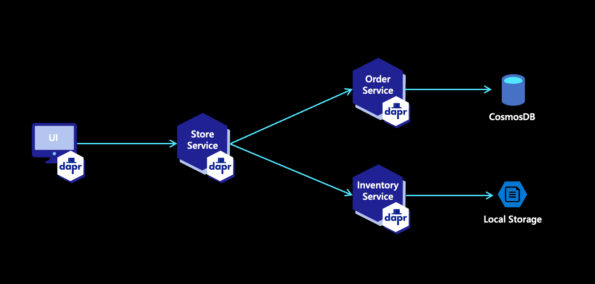

# Container Apps Demo

This is a sample microservice solution for Azure Container Apps.  It will create a series of microservices for managing orders and inventory. Dapr is used to secure communication and calls between services and Azure Cosmos DB is created alongside the microservices.

This demo is inspired by the Jeff Hollan demo. https://github.com/Azure-Samples/container-apps-store-api-microservice

## Quickstart

Deployment is done via Bicep with a simple bash script to get you started. You can fork the repo and run the below script in bash or GitHub Codespaces. 

Just run the `./start.sh` script to deploy everything. You can edit the `LOCATION` variable in the script if needed.

## Solution Overview

The demo includes a UI app and 3 microservices:

* Store Service
* Order Service
* Inventory Service



## Container Images

Container images are hosted in GitHub Container Registry.

The "official" images are here: https://github.com/orgs/Azure/packages?tab=packages&q=container-apps-demo

```
ghcr.io/azure/container-apps-demo/store-service
ghcr.io/azure/container-apps-demo/order-service
ghcr.io/azure/container-apps-demo/inventory-service
```

The below steps are for working locally, but this is optional.

```bash

export GITHUB_CR_PAT='' # set in bash profile
docker login ghcr.io -u chzbrgr71 -p $GITHUB_CR_PAT

export TAG='v1.50'

docker build -t chzbrgr71/store-service:$TAG ./store-service
docker build -t chzbrgr71/inventory-service:$TAG ./inventory-service
docker build -t chzbrgr71/order-service:$TAG ./order-service

docker tag chzbrgr71/store-service:$TAG ghcr.io/chzbrgr71/store-service:$TAG
docker tag chzbrgr71/inventory-service:$TAG ghcr.io/chzbrgr71/inventory-service:$TAG
docker tag chzbrgr71/order-service:$TAG ghcr.io/chzbrgr71/order-service:$TAG

docker push ghcr.io/chzbrgr71/store-service:$TAG
docker push ghcr.io/chzbrgr71/inventory-service:$TAG
docker push ghcr.io/chzbrgr71/order-service:$TAG

docker run --rm --name inventory -p 8081:8081 ghcr.io/azure/container-apps-demo/inventory-service:a1ebbb8

```

> Note: Container images must be manually marked as public

